This article describes how to configure high availability and automatic failover for NetApp SnapCenter software within AWS.

# SnapCenter High Availability using Virtual IP on AWS
NetApp SnapCenter software is an easy-to-use enterprise platform to securely coordinate and manage data protection across applications, databases, virtual machines, and file systems. SnapCenter simplifies backup, restore, and clone lifecycle management by offloading these tasks to application owners without sacrificing the ability to oversee and regulate activity on the storage systems. And by leveraging storage-based data management, it enables increased performance and availability, as well as reduced testing and development times.

Note: SnapCenter supports only 2-node configuration.

## License
By accessing, downloading, installing or using the content in this repository, you agree the terms of the License laid out in License file.

Note that there are certain restrictions around producing and/or sharing any derivative works with the content in this repository. Please make sure you read the terms of the License before using the content. If you do not agree to all of the terms, do not access, download or use the content in this repository.

Copyright: 2024 NetApp Inc.

## Features
The solution provides the following features:

* Continuous health check of the SMcore, MYSQL service along with EC2 instance availability
* Automatic failover to secondary SnapCenter EC2 instance incase of primary instance failure
* Perform manual failback using the lambda function

## Pre-requisites
Before you begin, ensure that the following prerequisites are met: 

* SnapCenter software is installed and configured on AWS EC2 instances with HA configuration across multiple Availability Zones
  Note: For information on how to install SnapCenter Server, see [SnapCenter Installation and Setup Guide](https://docs.netapp.com/us-en/snapcenter/install/task_install_the_snapcenter_server_using_the_install_wizard.html).
* Make sure that the repository path is identical on both nodes.
* Ensure the port numbers used for primary SnapCenter EC2 instance installation are also utilized for secondary SnapCenter EC2 instance installation
* Validate network connectivity between the SnapCenter EC2 instances
* Ensure that fully qualified domain names can be resolved to IPv4 addresses through DNS or local host configuration (c:\windows\system32\drivers\etc\hosts).
* Virtual IP address configured on both the EC2 instance's network interfaces (assuming an IP of 2.2.2.2)
  
  1.	Get the primary network adapter name of the EC2 instance by running the below command using command prompt or powershell
    ```
    # net interface show interface
    ```
  2. Enable DHCP static IP conexistence
    ```
    # net interface ip set interface interface="Ethernet" dhcpstaticipcoexistence=enable
    ```
  3.	Add virtual IP with subnet mask (same as your primary subnet) to the primary network interface using netsh command
  ```
  # netsh interface ip add address “Ethernet” 2.2.2.2 255.255.255.0
  ```
  4. Update the appropriate route table to point to primary instance for the configured Virtual IP

* Disable source/destination check on SnapCenter EC2 instances using AWS Console or the CLI.

  1.	Login to AWS EC2 dashboard console
  2.	Select the SnapCenter HA server instances, click on Actions -> Networking -> Change source/destination check -> select stop -> save
  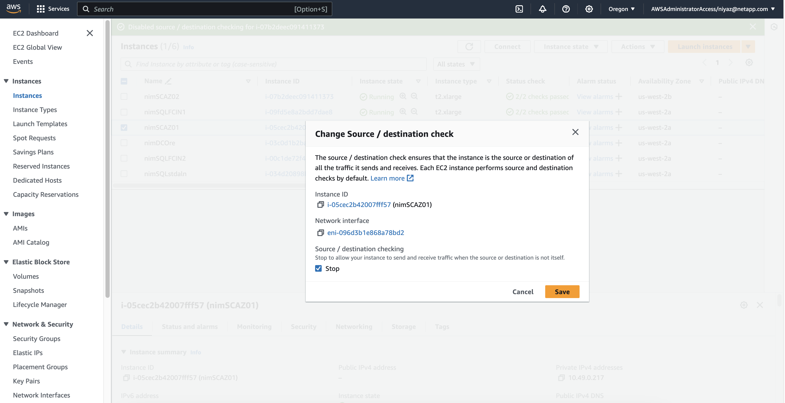
  Select Stop and click on Save (or)
  3.	Use AWS CLI command
  ```
  # aws ec2 modify-instance-attribute --instance-id <instance-id>   --source-dest-check "{\"Value\": false}"
  ```

* EC2 instances attached with instance IAM role with "arn:aws:iam::aws:policy/AmazonSSMManagedInstanceCore" or similar permissions
  1. Create EC2 instance IAM role
  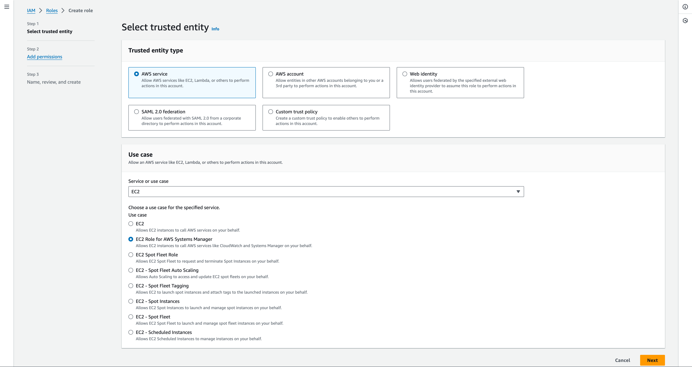
  Click on Next
  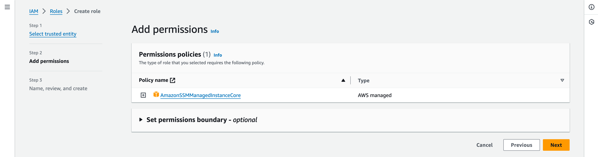
  Click on Next
  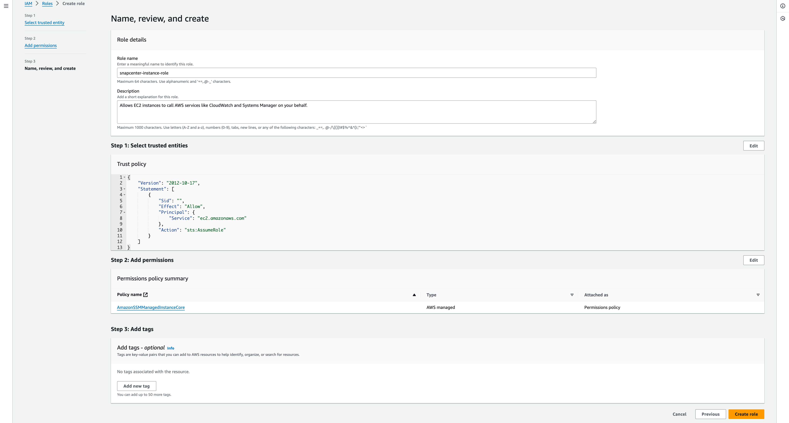
  Create Role

  2. Attach the EC2 instance role to both the SnapCenter servers
  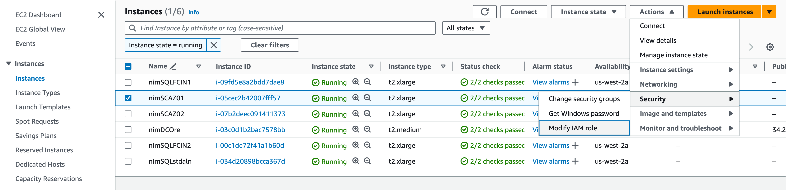
  Click on Modify IAM role
  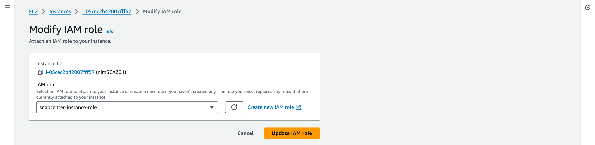
  Update IAM role

## Configuring MySQL HA

MySQL replication is a feature of MySQL Server that enables you to replicate data from one MySQL database server (master) to another MySQL database server (slave). SnapCenter supports MySQL replication for high availability only on two nodes.

Configure MySQL HA by running the following PowerShell cmdlets on designated primary SnapCenter EC2 instance:

Add-SmServerCluster -ClusterName <Cluster_Name> -ClusterIP <Cluster_IP> -PrimarySCServerIP <Node_1_IP_Address> -Verbose -Credential <Domain\User>

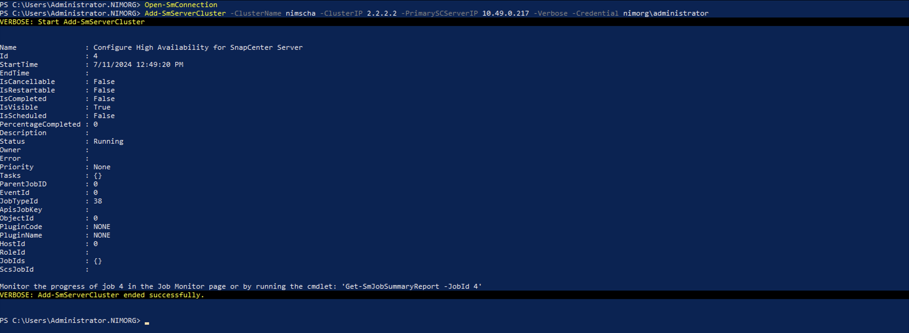

Add-SmServer -ServerIP <Node_2_IP_Address> -Verbose -Credential <Domain\User>

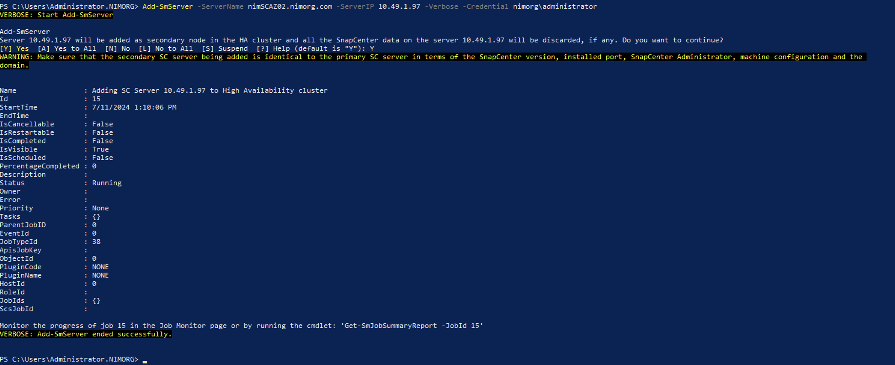

Run the below cmdlet to verify the state of HA configuration:

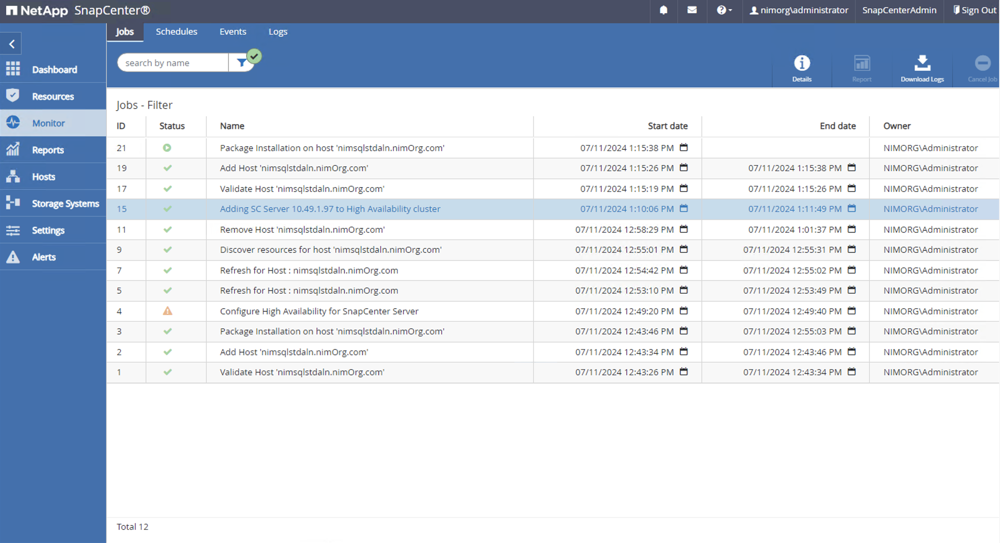

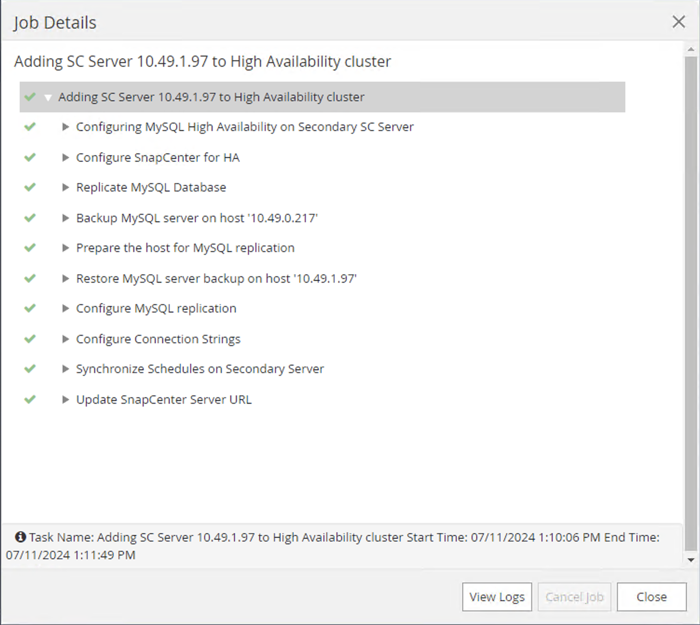

Get-SmServerConfig

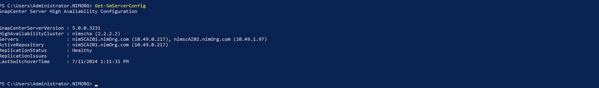

For information on how to run the cmdlets, see SnapCenter Software PowerShell Command Reference Guide.

**More Information**: SnapCenter performs read or write operations on the master repository and routes its connection to the slave repository when there is a failure on the master repository. The slave repository then becomes the master repository. SnapCenter also supports reverse replication, which is enabled only during failover.

SnapCenter provides the Get-SmRepositoryConfig and Set-SmRepositoryConfig PowerShell cmdlets to manage MySQL replication.

## Solution Architecture
Note : This solution is created based on the approach mentioned in this AWS blog - https://aws.amazon.com/de/blogs/apn/making-application-failover-seamless-by-failing-over-your-private-virtual-ip-across-availability-zones/

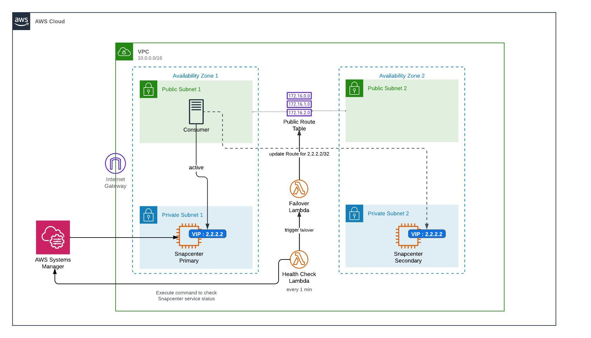

### Components
1. #### Health check lambda :
    - Monitors the status of SnapCenter SMcore and MySQL service on the primary EC2 intance every 2 minutes by using AWS Systems Manager RunCommand service
    - Triggers Failover lambda function in the event of primary EC2 instance failure 
    - Relies on a SSM parameter "/snapcenter/ha/primary_instance_id"
2. #### Failover lambda :
    - Updates the consumers Route table with the Virtual IP to point to the secondary SnapCenter EC2 instance
    - After successful failover, it updates the "/snapcenter/ha/primary_instance_id" SSM parameter to reflect the current primary server
3. #### IAM Roles, permissions
  * ##### Health check lambda role
    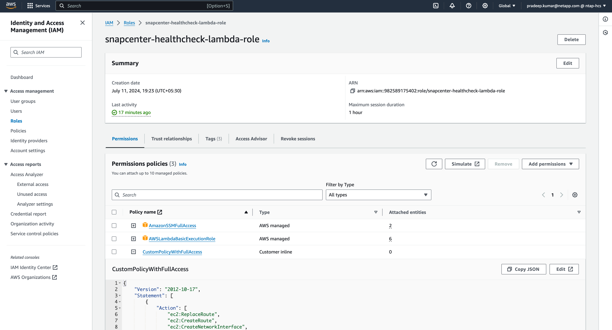

    CustomPolicy
    ```
    {
      "Version": "2012-10-17",
      "Statement": [
          {
              "Action": [
                  "ec2:ReplaceRoute",
                  "ec2:CreateRoute",
                  "ec2:CreateNetworkInterface",
                  "ec2:DescribeNetworkInterfaces",
                  "ec2:DeleteNetworkInterface"
              ],
              "Resource": "*",
              "Effect": "Allow",
              "Sid": "EC2"
          },
          {
              "Action": [
                  "ssm:GetParameter",
                  "ssm:PutParameter",
                  "ssm:SendCommand",
                  "ssm:GetCommandInvocation"
              ],
              "Resource": "*",
              "Effect": "Allow",
              "Sid": "SSM"
          },
          {
              "Action": [
                  "lambda:InvokeFunction"
              ],
              "Resource":   "arn:aws:lambda:us-west-2:982589175402:function:snap  center-failover-lambda",
              "Effect": "Allow",
              "Sid": "LambdaInvoke"
          }
      ]
    } 
    ```
  * ##### Failover lambda role
    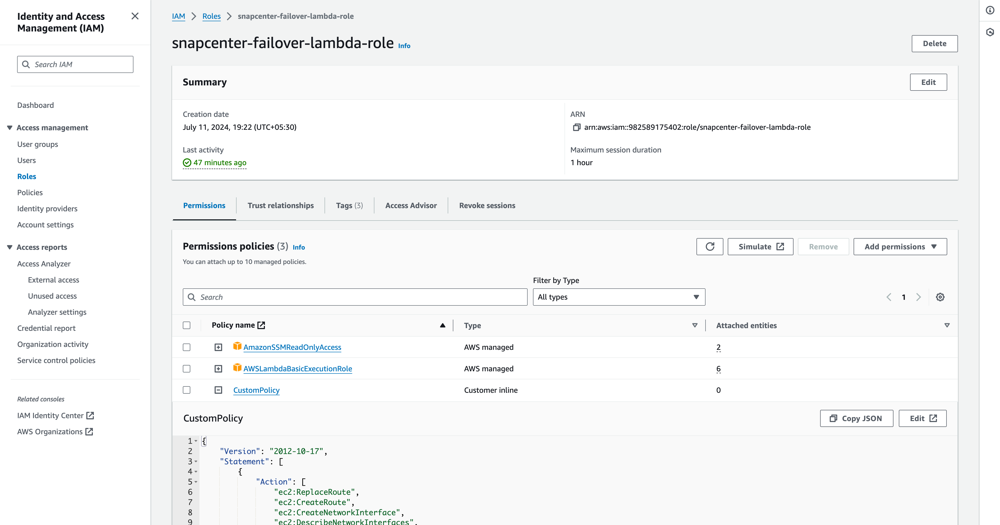

    CustomPolicy
    ```
    {
      "Version": "2012-10-17",
      "Statement": [
          {
              "Action": [
                  "ec2:ReplaceRoute",
                  "ec2:CreateRoute",
                  "ec2:CreateNetworkInterface",
                  "ec2:DescribeNetworkInterfaces",
                  "ec2:DeleteNetworkInterface"
              ],
              "Resource": "*",
              "Effect": "Allow",
              "Sid": "EC2"
          },
          {
              "Action": [
                  "ssm:GetParameter",
                  "ssm:PutParameter"
              ],
              "Resource": "*",
              "Effect": "Allow",
              "Sid": "SSM"
          }
      ]
    }
    ```

## Deployment Guide
#### Step 1 : Clone the GitHub repository
Clone the GitHub repository in your local system
```
# git clone https://github.com/NetApp/snapcenter-failover-automation.git
```

#### Step 2 : Setup an AWS S3 Bucket
1. Navigate to AWS Console > S3 and click on Create bucket. Create the bucket with the default settings.

2. Once inside the bucket, click on Upload > Add files and upload the 2 zip files under the "deploy" directory from the cloned repository
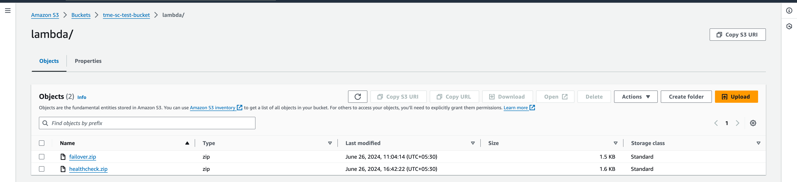

#### Step 3 : AWS CloudFormation Deployment
1. Navigate to AWS Console > CloudFormation > Create stack > With New Resources (Standard). Select "snapcenter-ha-cf.yaml" file from the "deploy" directory from the cloned repository
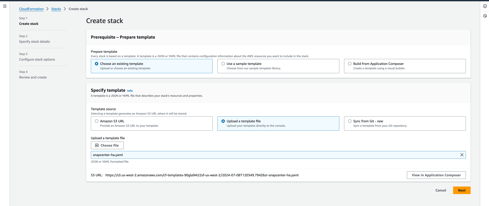
Click on Next

2. Enter the stack details. Click on Next and check the checkbox for "I acknowledge that AWS CloudFormation might create IAM resources" and click on Submit.
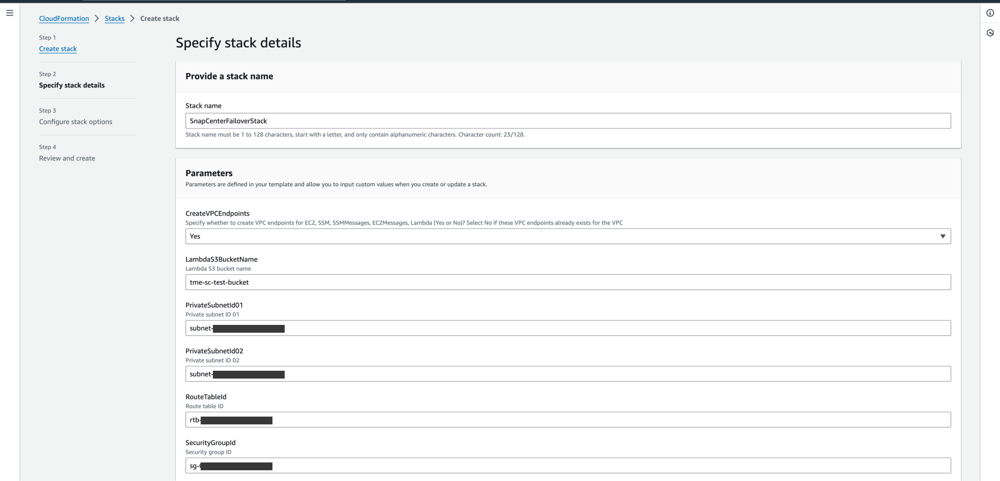
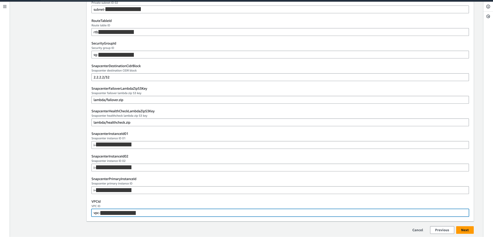
Click on Next

3. Once the CloudFormation stack deployment is completed, the health check of SnapCenter will begin and will failover in case of primary outage.

## Validated Environment
This solution was validated using Windows Server 2019 and NetApp SnapCenter version 5.0. The simulation of job within SnapCenter was performed using SQL Server as the application.

## Author Information

- [Pradeep Kumar](mailto:pradeep.kumar@netapp.com) - NetApp Solutions Engineering Team
- [Niyaz Mohamed](mailto:niyaz.mohamed@netapp.com) - NetApp Solutions Engineering Team
